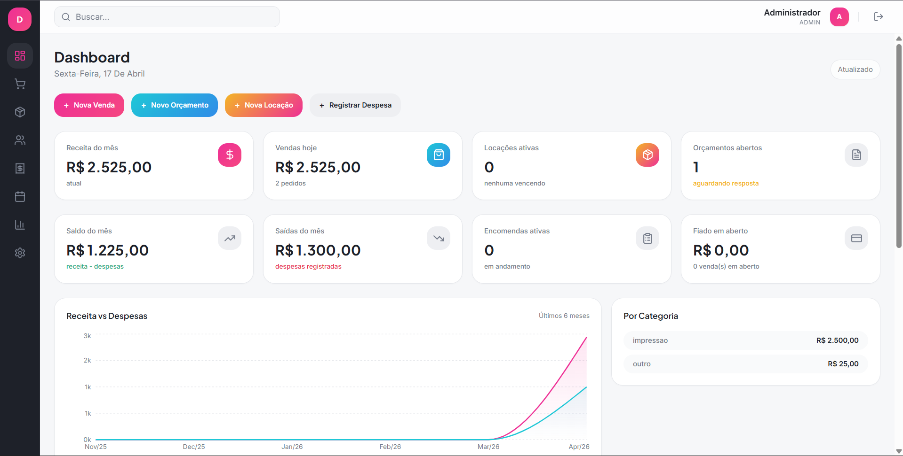

<div align="center">

# Dycore — Modern Management SaaS

**Plataforma de gestão integrada para empresas de decoração, brindes e locação.**
Backend em Flask · Frontend em React + Vite · Banco de Dados PostgreSQL (Neon.tech)

[](https://python.org)
[](https://flask.palletsprojects.com)
[](https://reactjs.org)
[](https://typescriptlang.org)
[](https://www.postgresql.org/)
[](LICENSE)

</div>

---

## Visão Geral

O **Dycore** é um ecossistema SaaS desenvolvido para modernizar o fluxo de trabalho de empresas que lidam com vendas, locações, produção de produtos personalizados e impressões. Com uma interface **compacta e intuitiva**, ele elimina o ruído visual e foca no que importa: a agilidade operacional.

### Interface Moderna

#### Tela de Login


#### Dashboard Integrado



*Sidebar ultra-compacto com submenus flyout e botões de acesso rápido.*

---

## Principais Módulos

| Módulo                          | Descrição                                                                     |
| :------------------------------- | :------------------------------------------------------------------------------ |
| **📊 Dashboard**           | Métricas em tempo real, evolução de faturamento e**ações rápidas**. |
| **🛒 Vendas & PDV**        | Caixa rápido com múltiplos pagamentos e geração automática de PDFs.        |
| **📦 Locação**           | Controle de contratos de locação e gestão de itens disponíveis por data.    |
| **📅 Agenda & Encomendas** | Calendário visual mensal integrado a prazos de encomendas e OS.                |
| **💰 Financeiro**          | Fluxo de caixa detalhado, gestão de despesas e controle de**Fiado**.     |
| **📋 Orçamentos**         | Geração de propostas profissionais com validade e QR Code PIX.                |
| **👥 CRM & Cadastros**     | Gestão de Clientes e Produtos com visualização moderna em**Cards**.    |
| **⚙️ Configurações**   | Controle total de usuários (Cargos), Módulos e personalização da Logo.      |

---

## 🛠️ Stack Tecnológica

- **Frontend:** React 18, Vite, TypeScript, Tailwind CSS, Lucide icons, Framer Motion.
- **Backend:** Flask (Python), ReportLab (PDFs), Werkzeug (Segurança).
- **Banco de Dados:** **PostgreSQL** hospedado na Neon.tech (escalabilidade e nuvem).
- **Segurança:** Autenticação via JWT com níveis de acesso (Admin, Gerente, Operador).

---

## 📥 Instalação e Uso Automático

### Pré-requisitos

1. **Python 3.10+** (Instalado e no PATH).
2. Conexão com a internet (para o banco de dados Neon).

### Como Iniciar (Windows)

Basta dar um duplo clique no arquivo:
 **`INICIAR_DYCORE.bat`**

O script realizará o setup completo e abrirá o sistema em seu navegador padrão em `http://localhost:5000`.

### Acesso Padrão

- **E-mail:** `admin@dripart.com`
- **Senha:** `123456`

---

## 📂 Estrutura de Diretórios

```bash
Projeto_Sistema_Gestao/
├── app.py                      # Core API Flask (Routes, Auth, Logic)
├── INICIAR_DYCORE.bat          # Script de inicialização automática
├── decor-venue-flow-main/      # Frontend
│   ├── src/
│   │   ├── pages/              # Telas (Dashboard, Agenda, PDV...)
│   │   ├── components/         # Sidebar flutuante, Layouts, UI
│   │   └── lib/                # api.ts, formats.ts, navigation.ts
│   └── dist/                   # Build otimizado para produção
└── docs/                       # Armazenamento temporário de PDFs gerados
```

---

## 🔒 Segurança e Permissões

- **Admin:** Controle absoluto de configurações, usuários e faturamento total.
- **Gerente:** Acesso a financeiro e relatórios, mas sem acesso a configurações globais.
- **Operador:** Acesso restrito a vendas, agenda e cadastros, sem visualização de lucros totais.

---

<div align="center">

Desenvolvido para máxima performance e elegância pela equipe Dycore SaaS. 💜

</div>
